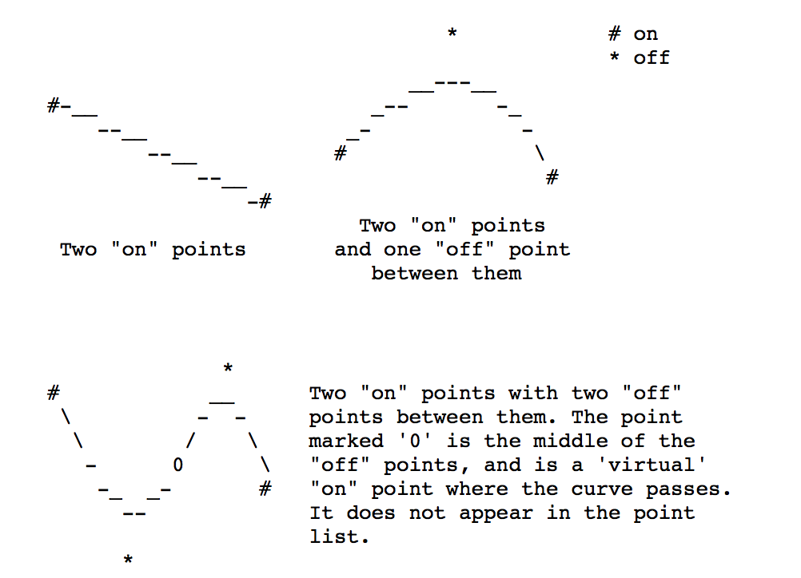
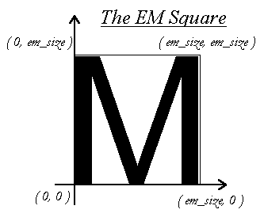
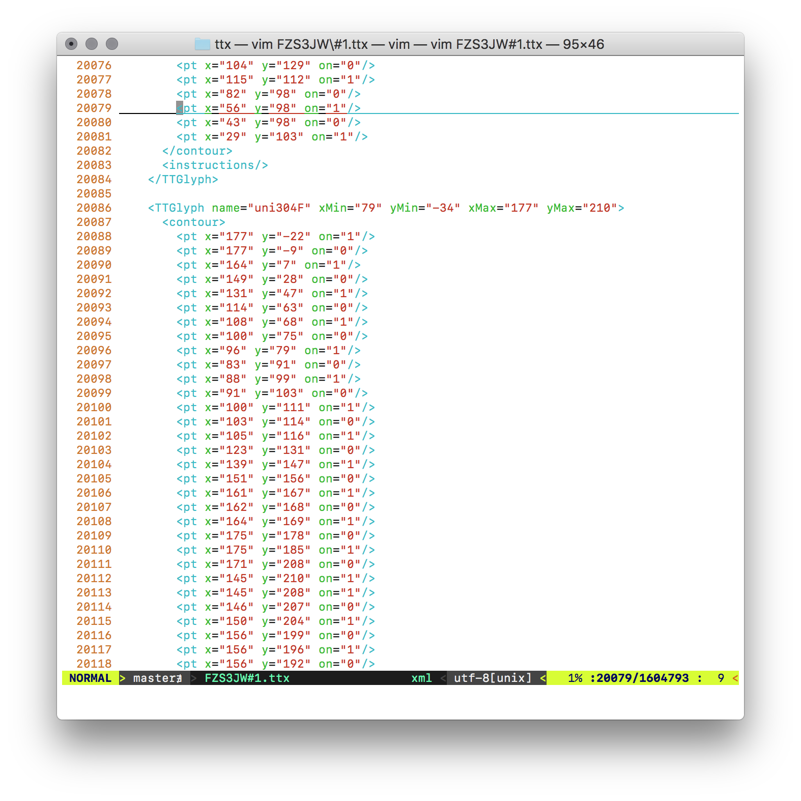
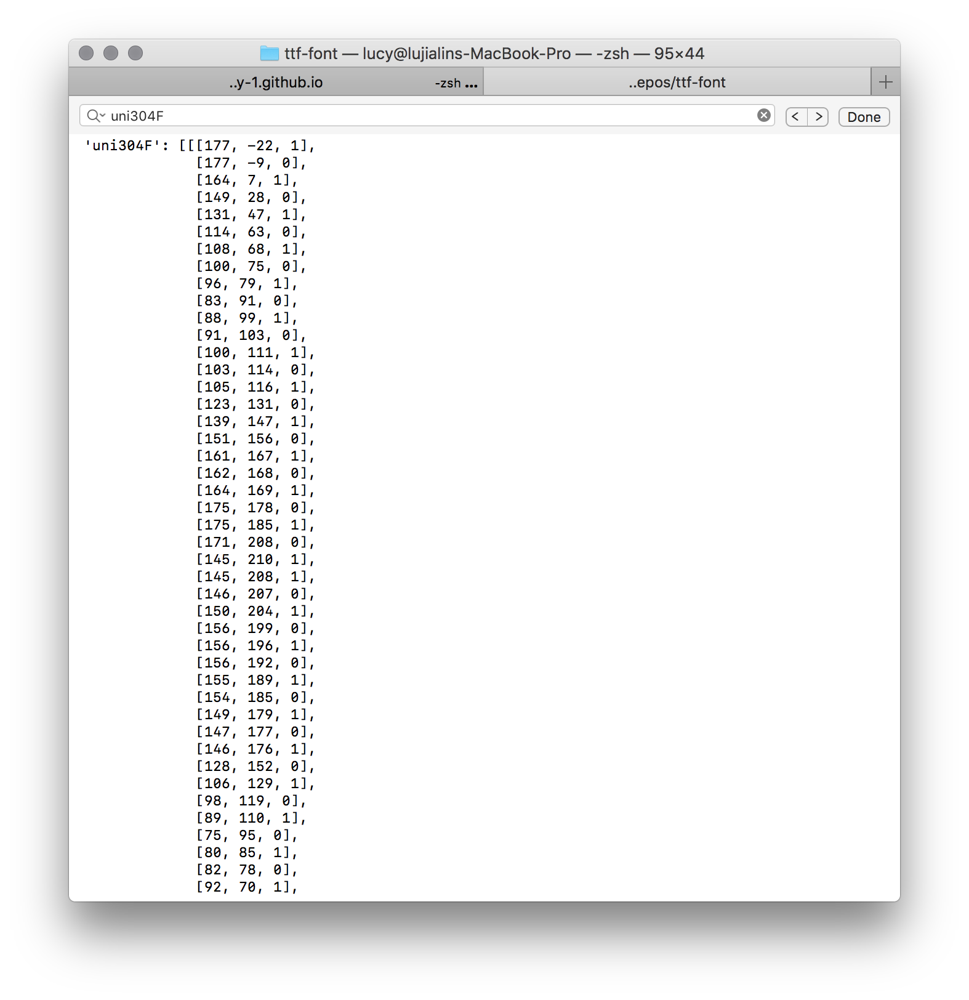

# A pre-prosssing script to extract Glyphs of fonts

## Requirements

- python 2 or 3
- python package `FontTools` v >= 3.25.0

```
    pip install pip install fonttools
```

## Glyph of characters

Each character is described as a **glyph** which is further described by a set of closed contours. And each contour is defined by a set of points.

Each point has three attributes: the x-axis location, the y-axis location and the condition of bezier curve: `on` or `off`.



## Main utilities

details see **font_utils.py**

1. DONE `decode`: given a ttf or otf format TrueType
2. STILL IN development `normalize`: normalize the EM square 
3. STILL IN development `render`: render a glyph
4. STILL IN development `glyph`: store a glyph in local file system

## An example of the Glyph formats of fonts

For the character with unicode **304f**, look up the **glyp** table of the font (In our case, we use 'FZS3JW.TTF' provided in the `src/` as an example and test case),



We could see the output of our extracted data as:



It shows that we successfully extracted the correct data.

Interesting readers about how the TrueType format could refer to

1. [An Introduction to TrueType Fonts: A look inside the TTF format](http://scripts.sil.org/cms/scripts/page.php?site_id=nrsi&id=iws-chapter08)
2. and [An introduction to glyphs, as used and defined in the FreeType engine:](http://chanae.walon.org/pub/ttf/ttf_glyphs.htm)

for the details of how glyphs are represented and rendered in our machines.
